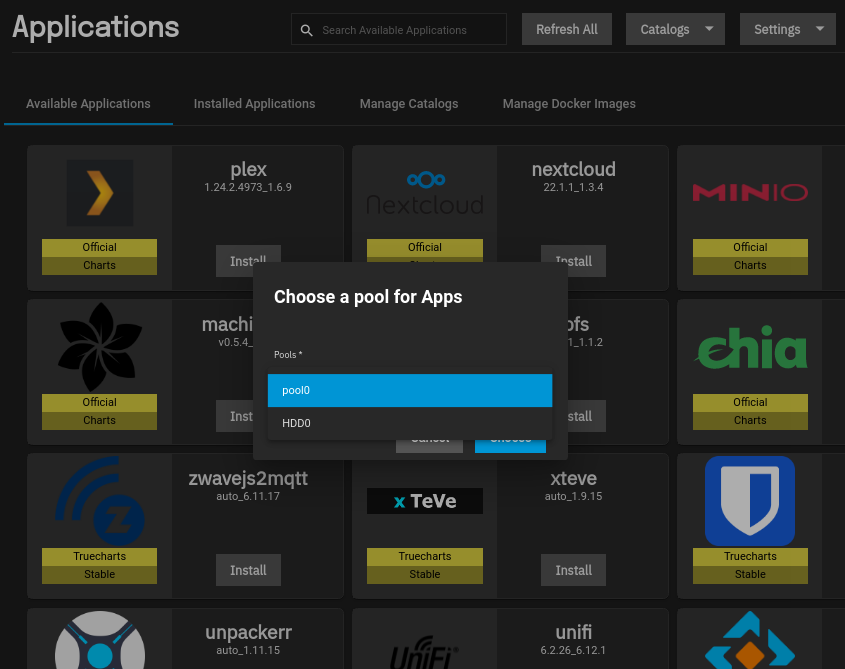
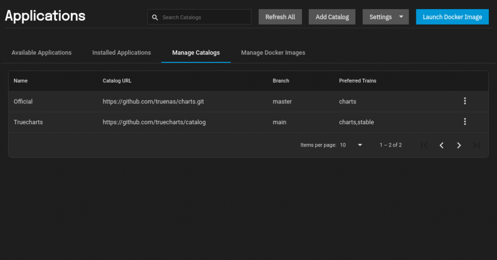
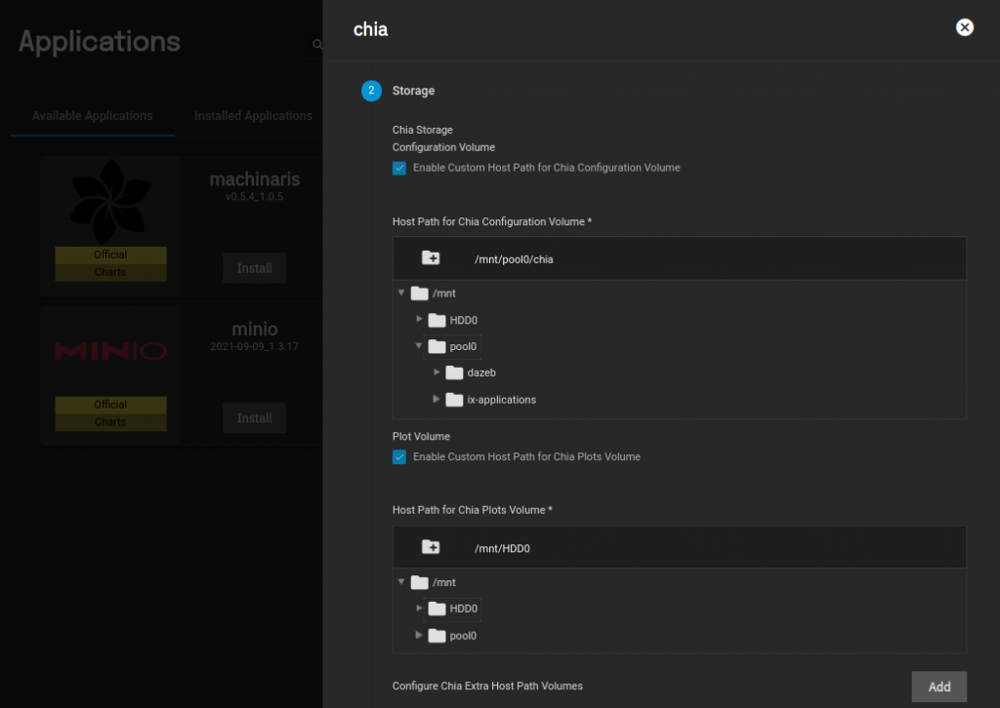
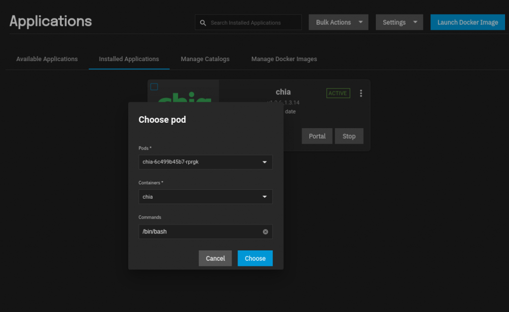
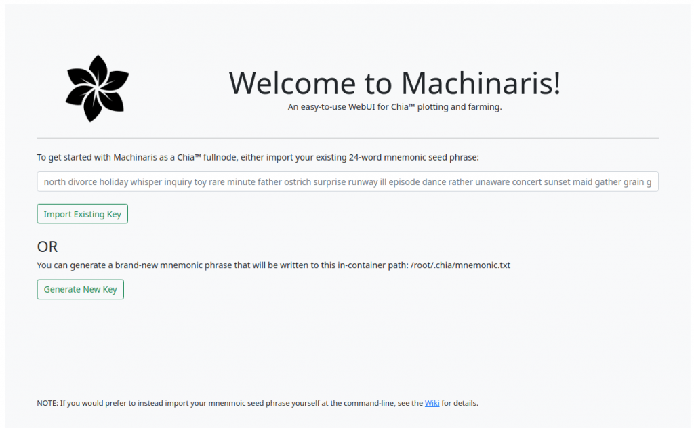

## Introduction:

After setting up Proxmox 7 to farm my Chia plots and mine Ethereum at the same time with each miner in their own virtual machine, i thought it would be good to try out TrueNAS SCALE as a main server for my SAMBA shares and since there is an official app made by the TrueNAS team for Chia im going to give it a go. Maybe install the Machinaris plugin also.

Also i will add some links where you can find more plugins for TruNAS.

## Requirements:

- TrueNAS SCALE Beta 1 - 21.08 installed and running. (For Proxmox use HOST CPU)
- A pool (SSD) for plotting (if this makes no sense don't worry).
- A pool for storing plots preferably large HDD.

## TrueNAS Dashboard:

TrueNAS SCALE BETA 1 21.08 Dashboard

This will be your main TrueNAS Dashboard view above. You can see i have `POOL0` and `HDD0`. Adding the drives is pretty self explanatory but we are going to jump straight into adding our plotting drive and our HDD to store the plots created.

## Adding Pools:

In the Pool Manager you should see any drives that you have attached to TrueNAS. Simply click suggest layout for TrueNAS to create a suggested layout if you have more than one drive. In this case i will be adding just one 4TB HDD

Creating a pool in TrueNAS

At this point you should have two pools, your main pool that was setup when you created the virtual machine or installed TrueNAS, and another pool or more that will be your storage for your pools. As you can see below we have one pool which will be our plotter and we will give it 300GB partitioned on a 1TB SSD that we passed through via Proxmox.

TrueNAS Storage pools

## Choosing Pool For Apps:

At this point we are pretty much ready to set up our applications but first we need to add an application dataset to our SSD pool. We do this by going to the `App`s tab and the notification to add a pool for your apps will pop up. You can choose any pool you like for storing your apps but i would recommend using your SSD not your HDD for your apps.

Choosing a pool for Apps in TrueNAS

You can also go to `Apps -> Settings -> Add pool` if the notification didn't pop up.

## Adding Apps With Truecharts

Before we install any apps here is how to get all the extra apps you see in the picture above.

Simply go to `Apps -> Manage Catalogue -> Add Catalogue`

We need to add the following catalog: [https://github.com/truecharts/catalog](https://github.com/truecharts/catalog)

Select the type of apps you want to see in the "Trains". Different choices will give you apps in different stages of development.

Adding a Catalog in TrueNAS

Once you have added the charts the `Manage Catalogs` tab will look like the image below.

Manage Catalogues TrueNAS

Now we are ready to install Chia on our TrueNAS SCALE system. Go back to `Apps` and deselect the Truecharts apps for now by clicking `Available Applications -> Catalogs` and deselect it for now so we only see the official apps.

TrueNAS disable truecharts

## Installing Chia or Mechanaris

Both apps have the ability to host a full node and plot. The TrueNAS devs have done a great job though packaging all the major apps needed like MadMax Plotter, the main Chia application into one bundle which works great and is constantly updated.

Choosing folders for Chia installation

The image above shows the storage configuration for the Chia app. You are just basically telling TrueNAS that you want to use your `POOL0` or SSD for the Chia app configuration and `HDD0` for your plots storage. All the needed folders will be created automatically. Click next on the next few boxes and submit the installation.

As soon as the app starts the full node will automatically start syncing.

At this point we can jump into the application shell by clicking the 3 dots on the chia app and selecting shell

Open Shell Chia App TrueNAS SCALE

A new window will open asking you to confirm

Start Chia Shell

Leave everything set to default and click `choose` to jump into the container. Below is the shell where you can submit your commands to do things like start or stop your container, or even plotting can be done in this window using madmax.

Chia App Shell

Some commands to use in the shell

`chia` - shows basic chia commands

`chia_plot` - this is the command for madmax, typing it will show you the madmax options for plotting

`chia stop all -d` - To stop all Chia daemons if you don't need a full node.

`chia farm summary` - for seeing your plots and farming status

`chia keys generate` - generate some default keys

`chia keys add` - Add already existing keys by mnemonic.

There are a lot of commands you can see here on a [previous guide at the bottom of the page](https://dazeb.uk/how-to-set-up-your-chia-farm-for-nft-plotting/) a list of basic and advanced Chia commands.

The official apps included and the corresponding commands are:

- `chia` - The main Chia program
- `chia_plot` - The MadMax Plotter
- `bladebit` - The BladeBit RAM Plotter
- `plotman` - The tool for enabling plotman monitoring / plotting
- /farmr - Location for the farmr chia monitoring bot/service.

Please see the [official TrueNAS website for information](https://truepool.io/kb/truepool-docker-image) on the Chia Docker Image.

What this shows is the commands to run the app. By typing the commands you will see a help page which will open up more information on commands that can be used.

## Machinaris - The GUI alternative

Machinaris is essentially the same thing as the Chia app but it comes with a beautiful GUI web interface and all the tools combined.

To install Machinaris simply follow the same instructions as the Chia app guide but instead of having to jump into the shell of the app you can open the portal. Once open you will be greeted with the landing page.

Machinaris main window

At this point we need to enter a key if you already have one or to generate new keys. If you don't need a full node with your private keys on it then i would suggest to generate a new key. It is not good practice to import any cold wallet keys ect because they are not needed for the majority of the work because we can send the keys needed for plotting when we decide to plot.

Here is a screenshot of the main window after adding or generating your new keys.

Machinaris Chia Dashboard

We need to edit some settings first so click `Settings -> Plotting`

Click `S`ave once before you edit the file

Now we can choose which type of pools we want to create and we can enter our keys so we can start plotting Chia plots. It is advisable to use NFT plots because of portability even if you are solo farming. The only real exception to this is for farming older Chia clones.

Machinaris Settings -> Plotting

## Adding Our Keys for Plotting

We need to get our keys for plotting and since i will be making NFT plots i will need my contract key from my main block of plots. You can do this by typing `chia plotnft show`

At this point you should be self explanatory. You can now start to play around and see what speeds you can achieve. You should also check out the [documentation for TrueNAS SCALE](http://www.truenas.com/docs/scale/printview/) to find out all of the features because if you are storing your plots using TrueNAS you have some extra functionality like [zfs pooling which allows you to add extra drives](http://www.truenas.com/docs/scale/printview/#pg-cc9c199e6e4394701122eb267faca21a) when needed amongst other extremely powerful products and features for the NAS community.

All in all, TrueNAS has provided an extremely useful application for their SCALE variant and while the software is in beta the future for TrueNAS SCALE looks extremely promising.
