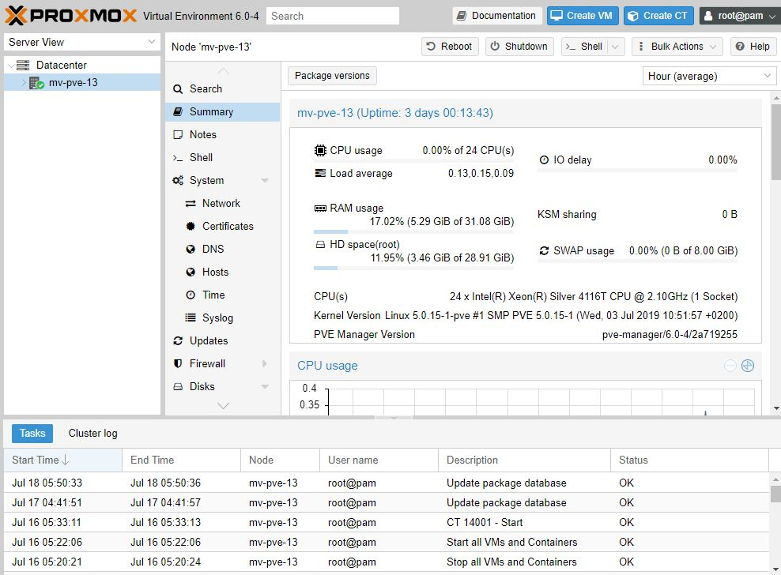
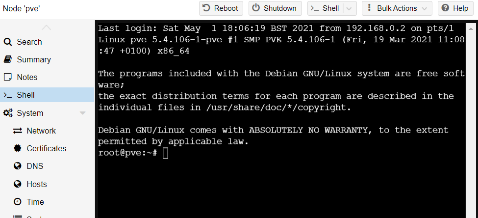

Proxmox is a Type 1 Hypervisor that is Open Source and free to use but one of the greatest benefits to this software is that while it is commercial in it's ability, it is still compatible with many computers and even laptops that are built within the last 10 years or so.

Type 1 Hypervisors are great for spinning up virtual machines giving you the best of both worlds with only a 1-3% performance drop from running a VM in Proxmox as in Bare Metal Hardware.

That said, this short guide will give you the essential commands and tools needed to setup and run Proxmox on old hardware. I will be using an old Lenovo T440s with an i7, 8GB of RAM and a 120GB Kingston SSD.

We will begin by completing the basic install which is extremely short, complete it by flashing to USB stick. Once complete you should be presented with something that looks like the picture below.



## Part 1 - Reclaim Space

Now first we need to enter some commands and get some space back from our root hard drive. Then we will remove our subscription warning notice and clean up our packages.

First go to the Proxmox GUI and Delete the local lvm.

Datacenter --> Storage --> Delete local lvm

IMAGE OF LOCAL LVM

Now to enter commands to delete the LV from the system and reclaim the space.

Click on the node and then click "shell".


You will be presented with the console for the main node.



Enter the commands, one at a time to delete and reclaim the space

```
lvremove /dev/pve/data
lvresize -l +100%FREE /dev/pve/root
resize2fs /dev/mapper/pve-root
```

Reclaimed! One last step to enable iso images on the main drive. Go to

Datacenter --> Storage --> Local--> Edit -->content


Enable the content types you want. Generally you can just choose them all but backups may fill the drive quick.

## Part 2 - Removing Subscription Warning.

Removing the subscriptrion nag screen error popup can be annoying so this simple oneliner will disable it permanently. Open up the node shell again and type

```
sed -Ezi.bak "s/(Ext.Msg.show\(\{\s+title: gettext\('No valid sub)/void\(\{ \/\/\1/g" /usr/share/javascript/proxmox-widget-toolkit/proxmoxlib.js && systemctl restart pveproxy.service
```

Reboot the machine and voila, nag pop up is gone.

## Part 3 - Bonus Content

If you have installed onto a laptop you can stop the machine from hibernating or sleeping when you close the lid. From the node shell, edit the service login file

```
nano /etc/systemd/logind.conf
```

Uncomment the following settings

```
HandleLidSwitch=ignore
HandleLidSwitchDocked=ignore
```

ctrl+x, Y then ENTER to save the edited file.

**ANOTHER BONUS - SAVE YOUR SCREEN**!

If when you close the lid the screen stays on you can fix that by editing the grub file

```
nano /etc/default/grub
```

Find the line GRUB\_CMDLINE\_LINUX and replace with

```
GRUB_CMDLINE_LINUX="consoleblank=300"
```

Now you can close the lid and turn off the screen power without shutting down the system!
